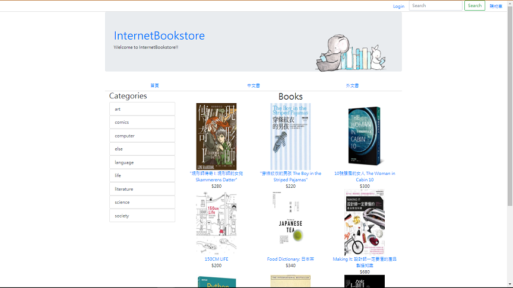
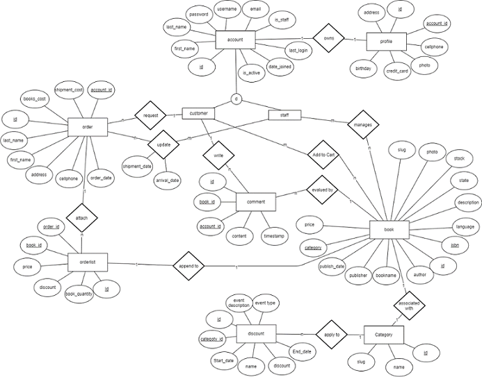
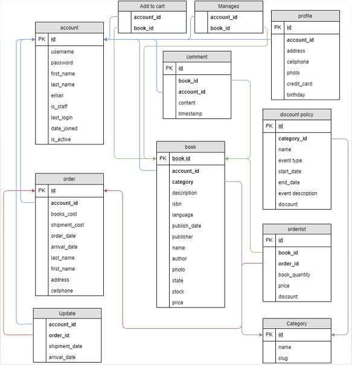

# Introduction

As the project name, it's a simple web book store.

The main purpose of this project is to let our team to learn `database`. 
From the begining design of the database to the implementation of the whole project, we make our project much complete and take some experiences on the relational database. Appreciate for all our teammates and professor that help us.

# Techniques

- [Bootstrap](https://getbootstrap.com/)
- [Django(web framework of python)](https://www.djangoproject.com/)
- [MySQL(database)](https://www.mysql.com/)

# UI

# Design of Relational Database

### ER diagram

### Database Schema

